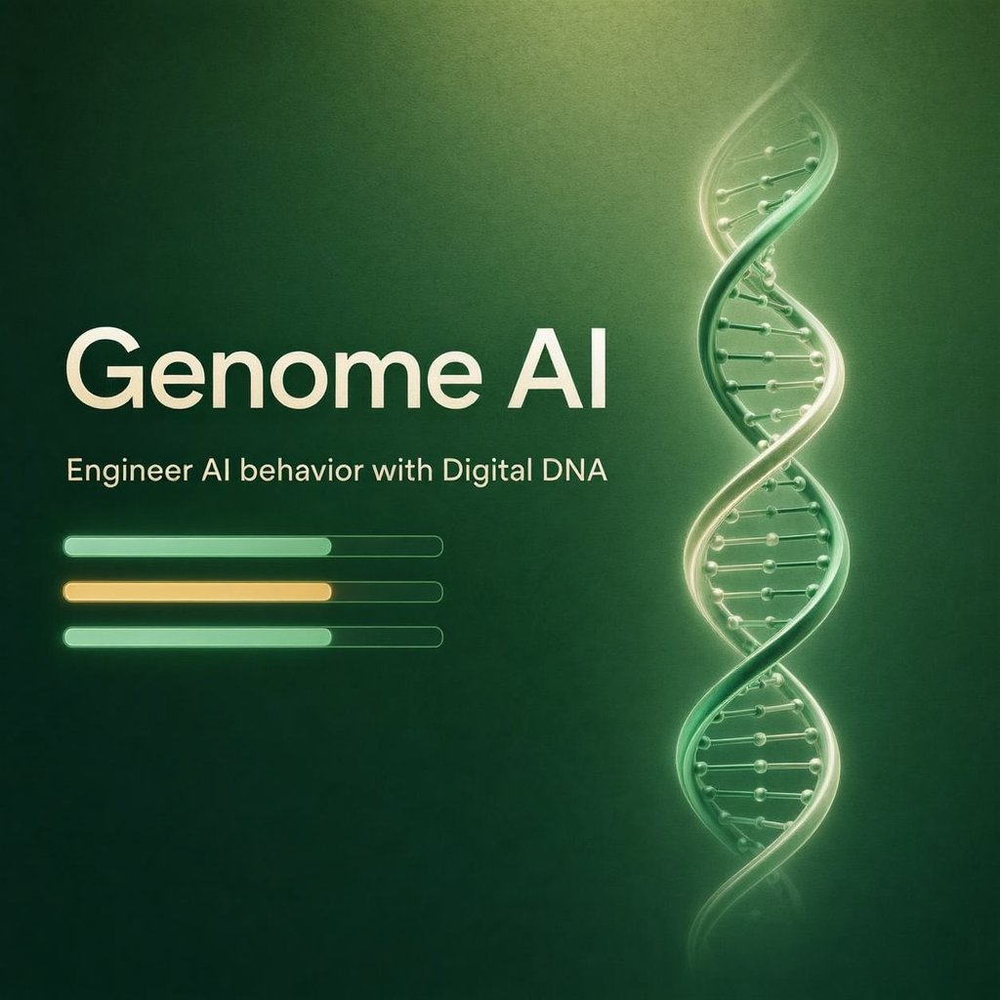

<p align="center">
  
</p>

<h1 align="center">🧬 Genome AI</h1>

<p align="center">
  <strong>Engineer AI behavior with Digital DNA — not prompts.</strong>
</p>

<p align="center">
  Genome AI is a platform for designing, testing, measuring, and versioning AI behavior
  through tunable <em>genes</em>. A <strong>Genome</strong> is a reusable behavioral
  blueprint that defines how an AI reasons, plans, verifies, remembers, and communicates.
</p>

<p align="center">
  <a href="https://genomeai.space">🌐 Website</a> ·
  <a href="https://docs.genomeai.space">📚 Docs</a> ·
  <a href="https://x.com/genomeai">𝕏 Twitter</a> ·
  <a href="#features">✨ Features</a>
</p>

<p align="center">
  
  
  
  
</p>

---

## 🧠 The one idea

> **AI behavior can be engineered through Digital DNA rather than prompt engineering.**

Prompts describe a single answer. Genomes describe a mind. A Genome is a structured set
of **10 tunable genes** (each scored 0–100) that the **Genome Engine** compiles into the
system instructions, memory policy, and tool policy the model actually runs.

Change a gene → the behavior changes. Predictably, measurably, reproducibly.

### The compile pipeline

```
Genome → Genome Engine → System Instructions → Memory Policy → Tool Policy → LLM → Response
```

## ✨ Features

### Landing experience
- **Hero** with a live genome visualization
- **What is a Genome?** — the behavioral blueprint explained
- **Interactive Playground** — same prompt, different DNA, different answer
- **Genome Editor demo** — drag a gene, watch behavior (and cost/latency) change live
- **Compiler diagram** — how a Genome becomes a running agent
- **vs Platforms** — how Genome AI compares to CrewAI / LangGraph / GPT Builder / Claude
- **Benchmark showcase** — ranked, measurable performance
- **Pricing, FAQ, About, Contact, Privacy, Terms** — full launch-ready site

### Workspace (after sign-in)
| Tool | What it does |
|------|--------------|
| **DNA Library** | Create, browse, duplicate, categorize, search & filter genomes |
| **DNA Editor** | Tune genes with sliders — never raw prompts. Live teaching explanations. |
| **Playground** | Run a task with a genome; review output + **"Why this answer?"** |
| **Compare** | Run multiple genomes on one task, side-by-side metrics |
| **Benchmark** | Score every genome across 7 standardized task families |
| **Version History** | Browse, diff, and restore genome versions |

## 🎛️ The Gene Catalog

Every Genome is built from these 10 genes across 3 categories:

| Gene | Symbol | Category | Controls |
|------|:------:|----------|----------|
| Reasoning | R | Cognitive | Depth of logical, step-by-step thought |
| Planning | P | Cognitive | Strategic foresight & sequencing |
| Verification | V | Cognitive | Self-checking, fact-keeping & caveats |
| Memory | M | Cognitive | Context retention & coherence |
| Creativity | C | Expression | Originality, metaphor & lateral leaps |
| Precision | X | Expression | Exactness, specificity & accuracy |
| Verbosity | B | Expression | Length & detail of the response |
| Risk | K | Personality | Boldness, unconventional moves |
| Empathy | E | Personality | Warmth, tone & human-centric framing |
| Autonomy | A | Personality | Decisiveness & initiative |

> 10 genes → billions of possible behaviors → each one a reusable, measurable blueprint.

## 🛠️ Tech stack

- **React 19** + **TypeScript**
- **Vite 7** (single-file build)
- **Tailwind CSS v4**
- Zero backend required for the MVP — genomes persist in `localStorage`
- A deterministic **behavior engine** + **benchmark engine** in `src/lib`

## 🚀 Quick start

```bash
# 1. install dependencies
npm install

# 2. start the dev server
npm run dev

# 3. build for production (outputs a single dist/index.html)
npm run build

# 4. preview the production build
npm run preview
```

Then open the printed local URL. No env vars, no API keys, no server.

> The behavior/benchmark engine is fully simulated and deterministic, so the demo runs
> end-to-end without any LLM calls. Every genome produces reproducible output.

## 📁 Project structure

```
src/
├── lib/
│   ├── dna.ts         # gene definitions, genomes, versioning, presets
│   ├── engine.ts      # behavior engine — genes → response + "why this answer"
│   ├── benchmark.ts   # standardized 7-category benchmark suite
│   ├── pricing.ts     # plan tiers & features
│   ├── store.tsx      # app state, routing, localStorage persistence
│   └── site.ts        # canonical site/URL config (genomeai.space)
├── components/
│   ├── ui/            # primitives, DNA visuals, OutputView, Analysis, AuthModal
│   ├── landing/       # hero, sections, pricing, faq, legal, gene catalog
│   └── dashboard/     # library, editor, playground, compare, benchmark, history
└── App.tsx            # router
```

## 🗺️ Roadmap

- [x] MVP — Editor, Playground, Compare, Benchmark, Versioning
- [x] Public marketing site + Pricing + FAQ + Legal
- [ ] **Genome Standard** — an open spec so any framework can compile DNA
- [ ] **API & SDK** — build & run genomes programmatically
- [ ] Cloud sync, sharing, templates (Builder tier)
- [ ] Team workspaces, benchmark suites (Professional tier)
- [ ] SSO, RBAC, audit logs, on-prem (Enterprise tier)

## 🤝 Contributing

Contributions are welcome! Please read [CONTRIBUTING.md](CONTRIBUTING.md) and our
[Code of Conduct](CODE_OF_CONDUCT.md) before opening an issue or pull request.

- 🐛 [Report a bug](.github/ISSUE_TEMPLATE/bug_report.md)
- ✨ [Request a feature](.github/ISSUE_TEMPLATE/feature_request.md)

## 📄 License

Released under the **MIT License** — see [LICENSE](LICENSE).

## 🔗 Links

- 🌐 Website: [genomeai.space](https://genomeai.space)
- 📚 Docs: [docs.genomeai.space](https://docs.genomeai.space)
- 𝕏 Twitter: [@genomeai](https://x.com/genomeai)
- 💬 Contact: [contact@genomeai.space](mailto:contact@genomeai.space)

---

<p align="center">
  <em>Behavior is programmable.</em>
</p>
